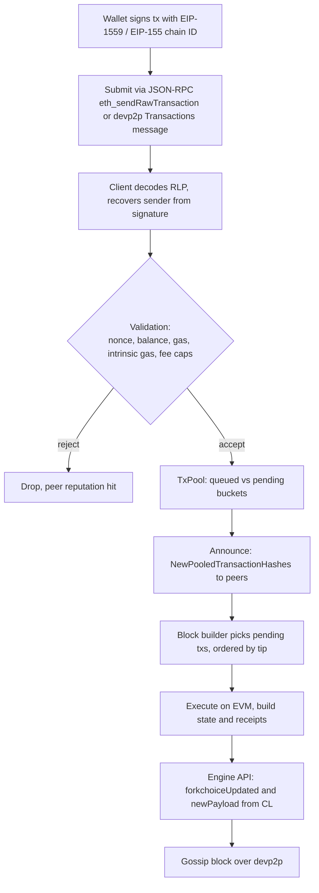

## How it works: Ethereum

Ethereum has multiple independent client implementations that all speak the same protocol. We'll trace a transaction through two of them — **Geth** (Go, [ethereum/go-ethereum](https://github.com/ethereum/go-ethereum)) and **Nethermind** (.NET, [NethermindEth/nethermind](https://github.com/NethermindEth/nethermind)) — to show how the same flow looks in different codebases. The shape is the same; the names differ.



> **What was The Merge?** On 15 September 2022, Ethereum switched its consensus mechanism from proof-of-work (miners burning electricity to find a hash) to proof-of-stake (validators putting up 32 ETH as collateral and being slashed for misbehaviour). The "merge" refers to the existing execution chain — accounts, contracts, balances — being joined to the new Beacon Chain that had been running PoS in parallel since December 2020. No history was lost; mining simply stopped at one block and the next block was proposed by a staker. Energy use dropped by ~99.95% overnight. The change was *enormous* socially and politically inside the project — which is a good place to flag that we'll cover governance in decentralised projects in a later chapter.

After The Merge, Ethereum is split between an **execution layer** (Geth, Nethermind, Besu, Erigon, Reth) and a **consensus layer** (Lighthouse, Prysm, Teku, Nimbus, Lodestar). The consensus client decides *which* block is canonical and *when* to build one; the execution client handles transactions, the EVM, and state. They talk over the [Engine API](https://github.com/ethereum/execution-apis/blob/main/src/engine/common.md). Everything below is the execution client's job.

### 1. Receiving a transaction

A transaction reaches a node via:

- **JSON-RPC** — `eth_sendRawTransaction`, normally from a wallet or dapp. The handler decodes the RLP-encoded transaction and submits it to the local tx pool.
- **devp2p** — peers gossip transactions using the `eth/68` subprotocol. Two relevant messages: `Transactions` (full bodies, for small txs) and `NewPooledTransactionHashes` (hashes only, fetch on demand).

In **Geth**, the RPC entry point is `PublicTransactionPoolAPI.SendRawTransaction` in `internal/ethapi/api.go`, which calls `SubmitTransaction` and ultimately `TxPool.Add`. The p2p side lands in `eth/handlers.go` → `handleTransactions` / `handleNewPooledTransactionHashes`.

In **Nethermind**, RPC enters at `EthRpcModule.eth_sendRawTransaction` in `src/Nethermind/Nethermind.JsonRpc/Modules/Eth/EthRpcModule.cs`, which calls `ITxSender.SendTransaction`. The p2p path is `Eth62ProtocolHandler.Handle(TransactionsMessage)` in `src/Nethermind/Nethermind.Network/P2P/Subprotocols/Eth/V62/`.

### 2. Validation

Both clients run the same logical checks; the names differ.

**Common checks:**

- RLP decodes cleanly into a known transaction type (legacy, EIP-2930 access list, EIP-1559 fee market, EIP-4844 blobs).
- Signature is valid for the configured chain ID (EIP-155). The sender is *recovered* from the signature — there is no "from" field on the wire.
- Sender's nonce matches (or is one of the next few — the pool buckets future-nonce txs as "queued").
- Sender has enough balance to cover `gasLimit * maxFeePerGas + value`.
- `gasLimit >= intrinsic gas` (21,000 base + calldata cost).
- `maxPriorityFeePerGas <= maxFeePerGas`.
- Tx size is below the protocol limit.

**Geth** — see `core/txpool/legacypool/legacypool.go` and `core/txpool/validation.go`. The function `ValidateTransaction` runs the static checks; `add()` then runs the stateful ones (nonce, balance) against the pool's view of state:

```go
// Sketch — core/txpool/legacypool/legacypool.go
func (pool *LegacyPool) add(tx *types.Transaction, local bool) (replaced bool, err error) {
    if err := pool.validateTxBasics(tx, local); err != nil { return false, err }
    if err := pool.validateTx(tx, local); err != nil { return false, err }
    // ... insert into queued or pending
}
```

Signature recovery uses `types.Sender(signer, tx)` in `core/types/transaction_signing.go`, which calls `crypto.Ecrecover` over secp256k1.

**Nethermind** — validation is composed of `ITxValidator` implementations in `src/Nethermind/Nethermind.TxPool/Filters/`. Each filter rejects for one reason: `GasLimitTooHighFilter`, `BalanceTooLowFilter`, `FeeTooLowFilter`, `MalformedTxFilter`, etc. The entry point `TxPool.SubmitTx` runs them in order:

```csharp
// Sketch — src/Nethermind/Nethermind.TxPool/TxPool.cs
public AcceptTxResult SubmitTx(Transaction tx, TxHandlingOptions handlingOptions)
{
    foreach (IIncomingTxFilter filter in _preHashFilters)
    {
        AcceptTxResult result = filter.Accept(tx, handlingOptions);
        if (!result) return result;
    }
    // ... add to pool, broadcast
}
```

Signature recovery is `EthereumEcdsa.RecoverAddress` in `src/Nethermind/Nethermind.Crypto/EthereumEcdsa.cs`.

### 3. The transaction pool

Once accepted, the transaction lives in the tx pool. Both clients separate it into two buckets:

- **Pending** — executable now: nonce is exactly `account.Nonce`, plus a contiguous run after that.
- **Queued** — future nonces, or otherwise not yet executable. Promoted to pending when the gap fills.

This is how a wallet can send tx with nonce N+5 before nonce N+1 lands — the pool holds it until the gap closes.

Both pools cap memory and evict by price/tip when full. **Geth** does this in `legacypool.demoteUnexecutables` and `truncatePending`. **Nethermind** does it in `TxPool.RemoveLast` driven by `_transactions` (a sorted set keyed by `IComparer<Transaction>` based on gas price).

After insertion, the pool announces to peers. Geth: `BroadcastTransactions` → `NewPooledTransactionHashes` (or full `Transactions` for small ones) in `eth/handler.go`. Nethermind: `TxBroadcaster.BroadcastOnce` in `src/Nethermind/Nethermind.TxPool/TxBroadcaster.cs`.

### 4. Building a block

Block production on a post-Merge execution client is *triggered* by the consensus layer via the Engine API call `engine_forkchoiceUpdatedV3` with `payloadAttributes` set. The execution client then assembles a block:

1. Snapshot the pending pool, ordered by **effective gas tip** (`min(maxPriorityFeePerGas, maxFeePerGas - baseFee)`) descending, then by nonce within each sender.
2. Execute transactions one by one against the state, accumulating receipts and gas used.
3. Stop when gas used reaches the block gas limit, or txs run out.
4. Compute the new state root, receipts root, logs bloom.
5. Return the payload to the consensus client, which proposes it.

**Geth** — `miner/worker.go` (`generateWork`, `commitTransactions`) for legacy, and `miner/payload_building.go` for the post-Merge path that responds to the Engine API. The ordering helper is `miner.transactionsByPriceAndNonce`.

**Nethermind** — `BlockProducerBase` in `src/Nethermind/Nethermind.Consensus/Producers/`, with `PostMergeBlockProducer` driving the Engine API path. Tx selection lives in `TxPoolTxSource.GetTransactions`, ordered by `ITxFilterPipeline`.

### 5. Broadcasting the block

After The Merge, the *execution* client doesn't gossip blocks for consensus — that's the *consensus* client's job over the beacon p2p network. But execution clients still gossip blocks over devp2p (`NewBlock`, `NewBlockHashes` in `eth/68`) so that fast-syncing or out-of-date peers can catch up at the execution layer. Validation on receipt is symmetric with production: decode → verify each tx signature → execute on the EVM → check the resulting state root matches the header.

**Geth** receives blocks in `eth/handlers.go` (`handleNewBlock`, `handleNewBlockHashes`) and validates them in `core/block_validator.go`. **Nethermind** does the same in `Eth62ProtocolHandler.Handle(NewBlockMessage)` and `BlockValidator` under `src/Nethermind/Nethermind.Consensus/Validators/`.

### Where to read more

**Geth**

- `internal/ethapi/api.go` — JSON-RPC handlers.
- `core/txpool/legacypool/legacypool.go` — the legacy tx pool. (`core/txpool/blobpool/` for EIP-4844.)
- `core/types/transaction_signing.go` — signature verification.
- `eth/handler.go`, `eth/protocols/eth/` — devp2p protocol handlers.
- `miner/worker.go`, `miner/payload_building.go` — block assembly.

**Nethermind**

- `src/Nethermind/Nethermind.JsonRpc/Modules/Eth/EthRpcModule.cs` — JSON-RPC.
- `src/Nethermind/Nethermind.TxPool/TxPool.cs` — tx pool.
- `src/Nethermind/Nethermind.TxPool/Filters/` — validation filters.
- `src/Nethermind/Nethermind.Crypto/EthereumEcdsa.cs` — signatures.
- `src/Nethermind/Nethermind.Network/P2P/Subprotocols/Eth/` — devp2p.
- `src/Nethermind/Nethermind.Consensus/Producers/` — block production.

The two codebases are written in different languages with different idioms, but the pipeline — *receive → validate → pool → build → broadcast* — is recognisable in both. That's what it means for Ethereum to have a single protocol with multiple implementations.
