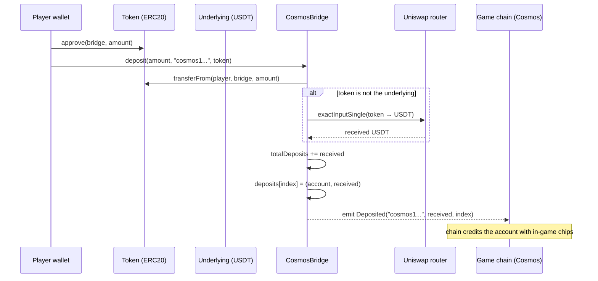

## Money in: the deposit path

A deposit is the act of moving real stablecoin into the bridge and recording a credit against a Cosmos account. There are two public entry points — `deposit` and `depositUnderlying` — and both funnel into one private `_deposit` that does the real work.

### The approve-first problem

Before the code, the quirk that shapes every token-pulling contract: **you cannot move someone else's tokens without their permission, and granting that permission is a separate transaction.**

Recall the two ways tokens move under ERC20:

- **`transfer(to, amount)`** — *I* move *my own* tokens. One transaction, signed by me.
- **`transferFrom(from, to, amount)`** — a *third party* moves tokens out of `from`'s balance, but only up to an **allowance** that `from` previously granted via `approve(spender, amount)`.

The bridge's deposit uses `transferFrom` — it pulls tokens *from the depositor into itself*. That means the depositor must have approved the bridge first. It's clumsy: two transactions, two gas fees, two wallet pop-ups, to do one logical thing. The classic flow is *approve, then deposit*, and asking ordinary users to do that dance in MetaMask — confirm an allowance, wait for it to mine, then confirm the deposit — trips a lot of people up. They approve and never deposit, or get lost in the two pop-ups. It's a real source of drop-off, and any production bridge has to decide how it wants to handle it (one-time infinite approvals, EIP-2612 `permit` signatures, or a relayer that does the approval for you).

> **Why is the approve/transferFrom split there at all?** It exists so a contract can pull tokens *as part of its own logic* (a swap, a deposit, a loan) rather than requiring the user to push tokens in and hope the contract notices. The allowance is the user saying "you may take up to X when you need it." It's a reasonable design — it's just awkward in the common case, which is why patterns like `permit` (EIP-2612, gasless approvals via signature) exist to paper over it.

### The two entry points

```solidity
function deposit(uint256 amount, string calldata receiver, address token) external returns (uint256) {
    (uint256 index, uint256 received) = _deposit(amount, msg.sender, receiver, token);
    emit Deposited(receiver, received, index);
    return index;
}

function depositUnderlying(uint256 amount, string calldata receiver) external returns (uint256) {
    (uint256 index, uint256 received) = _deposit(amount, msg.sender, receiver, underlying);
    emit Deposited(receiver, received, index);
    return index;
}
```

Both are thin wrappers around `_deposit`. The difference is which token you're depositing:

- **`deposit`** takes an explicit `token` argument — you can deposit *any* ERC20, and the bridge will deal with it (swapping to the underlying if needed).
- **`depositUnderlying`** is the fast path for when you're already holding the underlying stablecoin. It just passes `underlying` as the token, skipping the need to name it.

In both, `receiver` is a **`string`** — the Cosmos account name to credit, not an Ethereum address. And both pass `msg.sender` as the `from`: the deposit pulls tokens from *whoever called the function*. Each returns the deposit's index and emits a `Deposited` event so the off-chain chain can pick it up.

### The shared core: `_deposit`

```solidity
function _deposit(uint256 amount, address from, string calldata receiver, address token)
    private
    returns (uint256 index, uint256 received)
{
    IERC20(token).transferFrom(from, _self, amount);
    received = amount;

    if (router != address(0) && token != underlying) {
        received = _swap(token, underlying, amount, 0);
    }

    totalDeposits += received;

    deposits[depositIndex] = Deposit(receiver, received);
    depositIndex++;
    index = depositIndex;
}
```

This is where it happens. Step by step:

1. **`IERC20(token).transferFrom(from, _self, amount)`** — pull `amount` of the deposited token from the depositor into the bridge. This is the line that requires the depositor's prior approval. `received` starts equal to `amount`.
2. **The swap branch:** `if (router != address(0) && token != underlying)`. If a router is configured *and* the deposited token isn't already the underlying, the bridge swaps it on Uniswap, and `received` becomes the *output* amount of underlying. So a deposit of, say, DAI becomes some amount of USDT, and it's that USDT amount we credit. If the token *is* the underlying, this branch is skipped and `received` stays as the deposited amount.
3. **`totalDeposits += received`** — add the underlying-denominated amount to the running total of what's owed to players.
4. **Record and index:** store `Deposit(receiver, received)` at the current index, then increment.

There's a subtle off-by-one worth noticing: the deposit is stored at `deposits[depositIndex]`, *then* `depositIndex++` runs, *then* `index = depositIndex` is returned. So the returned `index` is one greater than the slot the deposit was actually written to. The emitted event carries this returned value. It's the kind of detail that doesn't break anything on its own but will confuse whoever later tries to look up a deposit by the index they were given — exactly the sort of thing to pin down with a test.

### The Uniswap swap

```solidity
function _swap(address tokenIn, address tokenOut, uint256 amountIn, uint256 amountOutMinimum)
    internal
    returns (uint256 amountOut)
{
    ISwapRouter swapRouter = ISwapRouter(router);

    // Approve the router to spend TOKEN.
    IERC20(tokenIn).approve(address(swapRouter), amountIn);

    ISwapRouter.ExactInputSingleParams memory params = ISwapRouter.ExactInputSingleParams({
        tokenIn: tokenIn,
        tokenOut: tokenOut,
        fee: 1000,
        recipient: _self,
        amountIn: amountIn,
        amountOutMinimum: amountOutMinimum,
        sqrtPriceLimitX96: 0
    });

    amountOut = swapRouter.exactInputSingle(params);
}
```

This composes with **Uniswap V3** to convert a non-underlying token into the underlying. It approves the router for the input token, builds an `ExactInputSingleParams` struct describing the swap — in token, out token, pool fee tier, recipient, amounts — and calls `exactInputSingle`, which performs the swap and returns how much came out.

Two things deserve a hard look:

> **`amountOutMinimum: 0` is dangerous.** `_deposit` calls `_swap(token, underlying, amount, 0)` — it asks for a swap with **no minimum output**. That means the swap will accept *any* amount of underlying in return, including almost nothing. On a public mempool this is an open invitation to a **sandwich attack**: a bot sees the pending swap, moves the price against it, lets the victim's swap execute at the terrible rate, and pockets the difference. Uniswap's own example code even comments that you should "use an oracle or other data source to choose a safer value for `amountOutMinimum`" — and this contract has hardcoded the unsafe value. In production this needs a real slippage bound (a quote from an oracle or an off-chain quoter, with a tolerance), not `0`.

> **The `fee: 1000` tier is fixed.** The pool fee is hardcoded to the 0.1% tier. If no pool exists at that tier for the given pair, the swap reverts; if a deeper pool exists at another tier, the contract can't use it. Fine for a single known pair, brittle if the set of accepted tokens grows.

### The deposit flow end to end



The player approves once, then deposits. The bridge pulls the tokens, swaps to the underlying if necessary, records the credit against the Cosmos account name, and emits an event. The off-chain chain is watching for that event and credits the named account with chips.

---

That's money *in*. Notice what the bridge has *not* done: it hasn't given the player any on-chain token in return — the credit lives entirely in the `deposits` log and, from there, on the game chain. Next we follow the money *out*: withdrawals, which can't just be triggered by anyone, and so are gated by **validator signatures**.
