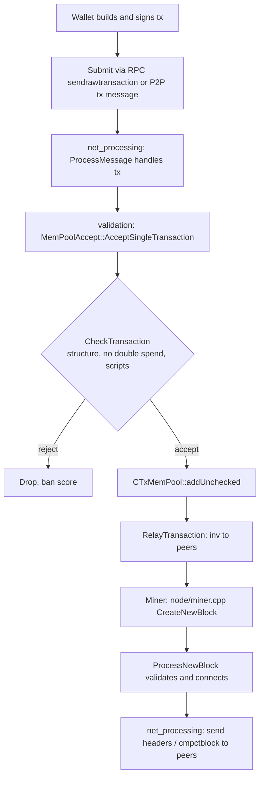

## How it works: Bitcoin

The previous sections introduced the layers. This section walks through what actually happens to a transaction inside Bitcoin Core, from the moment a node receives bytes on the wire to the moment a block containing the transaction is gossiped back out. References point at files in [bitcoin/bitcoin](https://github.com/bitcoin/bitcoin) on the `master` branch — line numbers drift, so search by symbol.



### 1. Receiving a transaction

A transaction enters a node one of two ways:

- **RPC** — a wallet calls `sendrawtransaction`. The handler is `sendrawtransaction()` in `src/rpc/mempool.cpp`, which deserialises the hex into a `CTransaction` and forwards it to the mempool acceptance path.
- **P2P** — a peer sends a `tx` message. The dispatcher is `PeerManagerImpl::ProcessMessage` in `src/net_processing.cpp`. The branch handling `NetMsgType::TX` reads the transaction off the wire and calls `ProcessTransaction()`, which in turn calls into `MemPoolAccept`.

Both paths converge on the same validator. There is no separate "RPC validation" — the rules are the rules.

### 2. Validation: structure, scripts, signatures

Validation lives in `src/validation.cpp` under the `MemPoolAccept` class. The entry point is `MemPoolAccept::AcceptSingleTransaction`, which orchestrates a sequence of checks:

```cpp
// Sketch — abridged from src/validation.cpp
bool MemPoolAccept::AcceptSingleTransaction(const CTransactionRef& ptx, ATMPArgs& args)
{
    Workspace ws(ptx);
    if (!PreChecks(args, ws))            return false; // structural / policy
    if (!PolicyScriptChecks(args, ws))   return false; // standardness
    if (!ConsensusScriptChecks(args, ws))return false; // signatures / scripts
    return Finalize(args, ws);                          // insert into mempool
}
```

The pieces it leans on:

- **`CheckTransaction`** in `src/consensus/tx_check.cpp` — payload sanity: non-empty inputs/outputs, no duplicate inputs, value ranges, size limits. These are context-free checks.
- **`Consensus::CheckTxInputs`** in `src/consensus/tx_verify.cpp` — checks inputs against the UTXO set: are the outputs being spent unspent, mature (for coinbases), and is `sum(in) >= sum(out)`?
- **`CheckInputScripts`** / **`VerifyScript`** in `src/script/interpreter.cpp` — runs each input's `scriptSig` (and witness for SegWit) against the previous output's `scriptPubKey`. This is where ECDSA / Schnorr signature verification happens, via `EvalChecksig` and `CheckECDSASignature` / `CheckSchnorrSignature`.

If any check fails, `AcceptSingleTransaction` returns a `TxValidationState` describing why; the caller in `net_processing.cpp` translates that into a peer misbehaviour score (`Misbehaving`) when the source is a peer.

### 3. The mempool

A passing transaction is inserted into `CTxMemPool` (`src/txmempool.cpp`) via `addUnchecked`. The mempool is an in-memory multi-index: indexed by `txid` and `wtxid` for lookup, by ancestor/descendant fee for mining, and by entry time for eviction. It enforces:

- A configurable byte-size cap (`-maxmempool`, default 300 MB) — `TrimToSize` evicts the lowest-fee packages when full.
- `BIP125` replace-by-fee semantics — `MemPoolAccept::PreChecks` handles RBF replacement.
- A minimum relay fee (`-minrelaytxfee`).

Once accepted, `RelayTransaction` in `src/net_processing.cpp` queues an `inv(MSG_WTX)` to all peers that have signalled support. Peers fetch the body with `getdata`. This is how transactions propagate across the network.

### 4. Building a block

A miner calls `getblocktemplate` (RPC) or runs `BlockAssembler` directly. The implementation is `BlockAssembler::CreateNewBlock` in `src/node/miner.cpp`. The greedy algorithm:

1. Start with an empty block plus a placeholder coinbase.
2. Pull mempool entries in descending **ancestor fee rate** order (`addPackageTxs`) — this respects parent/child dependencies.
3. Stop when the block hits `nBlockMaxWeight` or runs out of profitable txs.
4. Fill in the coinbase output (subsidy + fees).
5. Compute the merkle root and return a `CBlockTemplate`.

External miners then iterate the nonce (and witness commitment) until the block hash meets the target.

### 5. Broadcasting the block

When a valid block arrives — either built locally or received from a peer — it flows through `ProcessNewBlock` in `src/validation.cpp`, which calls `CheckBlock`, then `AcceptBlock`, then `ActivateBestChain` to update the chain tip.

Once the tip moves, `PeerManagerImpl` in `src/net_processing.cpp` pushes the new header out:

- High-bandwidth peers get a `cmpctblock` (BIP 152 compact block) immediately.
- Other peers get a `headers` announcement and pull the block with `getdata` if they need it.

The receiving peer runs the same validation and the cycle repeats. That feedback loop — receive, validate, gossip — is the entire consensus mechanism at the network layer.

### Where to read more

- `src/net_processing.cpp` — the protocol handler. Search for `NetMsgType::TX` and `NetMsgType::BLOCK`.
- `src/validation.cpp` — `MemPoolAccept` and `ProcessNewBlock`.
- `src/txmempool.cpp` — the mempool data structure.
- `src/node/miner.cpp` — block assembly.
- `src/script/interpreter.cpp` — script and signature evaluation.

### A toy node, in C#

To make the pipeline concrete, the repo ships a minimal C# console app that exercises the same five steps against real mainnet peers: DNS-seed discovery, version/verack handshake, `getheaders` from genesis, PoW + merkle verification, and SQLite persistence. The mempool is a `List<Transaction>` — exactly as we said it could be.

See [`code/csharp_bitcoin_node/`](../code/csharp_bitcoin_node/) — `dotnet run` is enough to watch a node bootstrap itself.
